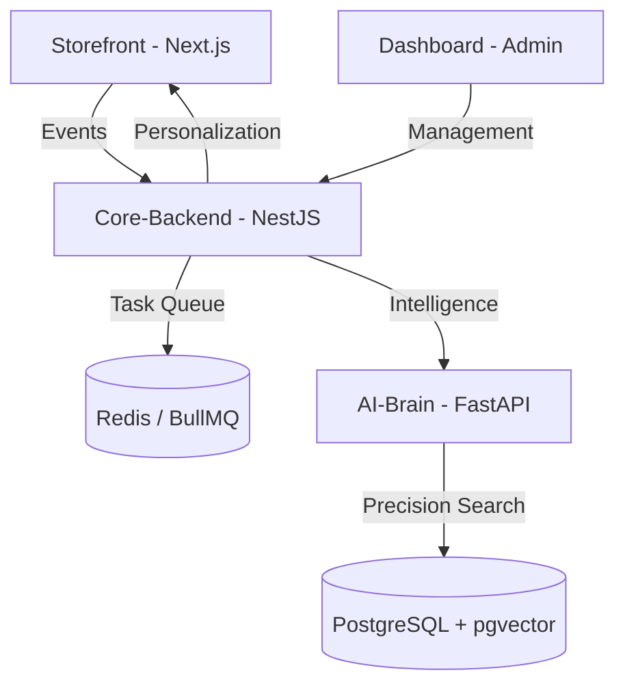

# 🏔️ ZENTO: Precision Workspace & Tech Lifestyle

[](https://opensource.org/licenses/MIT)
[](#-tech-stack)
[](#-architecture)

**ZENTO** is a premium ecommerce platform designed for the modern professional. We curate high-end workspace gear and tech lifestyle essentials, delivering a personalized shopping experience that respects your focus and rewards your taste.

---

## 🌟 The ZENTO Experience

-   **🎯 Curated Personalization**: A shopping journey that adapts to your preferences, surfacing the right tools for your specific workflow.
-   **⚡ Effortless Discovery**: Real-time suggestions and tailored collections that simplify finding your next setup upgrade.
-   **🧠 Precision Search**: Semantic, intent-aware search that understands exactly what you're looking for.
-   **🏗️ Engineered for Focus**: A high-performance, editorial storefront designed with a minimal, Techno-Industrial Noir aesthetic.
-   **📊 Workspace Insights**: Internal analytics that help us refine our collection to better serve the professional collective.

---

## 🛠️ Core Technology

ZENTO is built on a production-grade monorepo stack optimized for performance and reliability:

-   **Frontend**: [Next.js 14](https://nextjs.org/) (App Router), [Tailwind CSS](https://tailwindcss.com/) — A premium, editorial commerce storefront.
-   **Backend**: [NestJS](https://nestjs.com/) (Clean Architecture) — Secure, scalable commerce engine.
-   **Intelligence Layer**: [Python FastAPI](https://fastapi.tiangolo.com/) — Powers internal personalization and intent analysis.
-   **Infrastructure**: [PostgreSQL](https://www.postgresql.org/) (pgvector), [Redis](https://redis.io/), [RabbitMQ](https://www.rabbitmq.com/).

---

## 🏗️ Architecture

ZENTO utilizes a specialized monorepo structure to separate concerns and ensure a seamless experience:



---

## 📂 Monorepo Map

```text
zento/
├── apps/
│   ├── storefront/     # The Product: Premium customer experience
│   ├── dashboard/      # Admin & Operational Intelligence
│   ├── core-backend/   # Commerce logic, API & Infrastructure
│   └── ai-brain/       # Personalization & Intent processing
├── packages/
│   ├── event-schema/   # Single Source of Truth for behavior data
│   ├── types/          # Shared TypeScript interfaces
│   └── shared/         # Reusable commerce utilities
└── docker-compose.yml  # Infrastructure (Postgres, Redis, MQ)
```

---

## 🚀 Getting Started

### Prerequisites

-   [Node.js 18+](https://nodejs.org/)
-   [Yarn 4+](https://yarnpkg.com/)
-   [Docker & Docker Compose](https://www.docker.com/)

### 1. Initialize Infrastructure

```bash
docker compose up -d
```

### 2. Install & Build

```bash
yarn install
yarn build
```

### 3. Start Development

```bash
yarn dev
```

---

## 📜 Engineering Standards

-   **Strict TypeScript**: No `any` allowed. Complete type safety across boundaries.
-   **Clean Architecture**: Business logic is decoupled from external interfaces.
-   **Async Processing**: Heavy operations (personalization, emails) are handled via message queues.
-   **Modular Design**: Reusable packages for events, types, and configurations.

---

## 👨‍💻 Author

**Hoang Thanh** - *Visionary Engineer*

---
© 2026 ZENTO. Built for the future of workspace.
