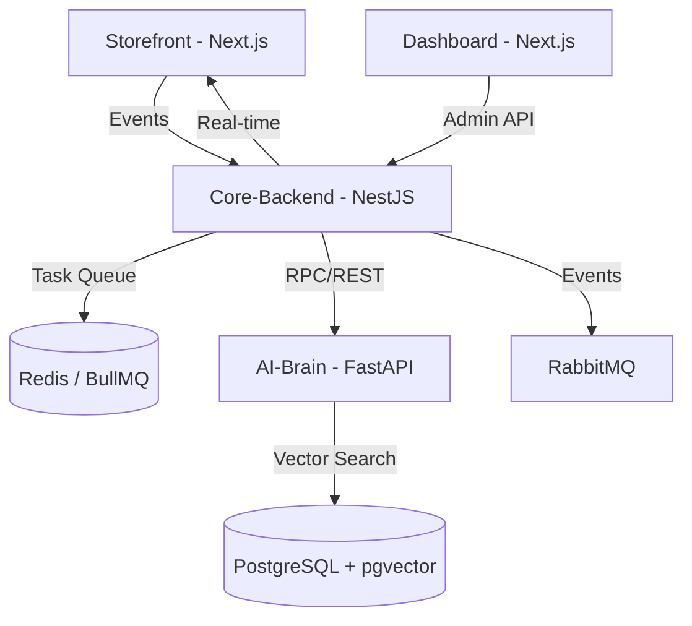

# 🚀 NexusAI: Behavioral Commerce Intelligence Platform

[](https://opensource.org/licenses/MIT)
[](https://nexusai.io)
[](#-architecture)

**NexusAI** is a hyper-personalized commerce platform that bridges the gap between customer behavior and retail intelligence. By leveraging real-time behavioral tracking (clicks, hovers, scroll patterns), the platform utilizes high-performance AI to classify customer **Personas** and deliver instant, context-aware shopping suggestions via WebSockets.

---

## 🌟 Key Features

-   **🎯 Behavioral Persona Scoring**: Latency-free classification of users based on micro-interactions (clicks, hovers, dwell time).
-   **⚡ Real-time Smart Nudges**: Contextual product recommendations and incentives delivered via Socket.io.
-   **🧠 AI-Driven Insights**: Vector-based semantic search and similarity matching using `pgvector`.
-   **🏗️ Event-Driven Scaling**: Asynchronous task processing for persona calculation and notification delivery using BullMQ and RabbitMQ.
-   **📊 Analytics Dashboard**: Comprehensive view of customer behavior patterns and conversion funnels.

---

## 🛠️ Tech Stack

NexusAI is built with a modern, high-performance tech stack designed for scalability and developer experience:

-   **Frontend**: [Next.js 14+](https://nextjs.org/) (App Router), [Tailwind CSS](https://tailwindcss.com/), [Lucide React](https://lucide.dev/).
-   **Backend**: [NestJS](https://nestjs.com/) (Clean Architecture, DDD), [Prisma ORM](https://www.prisma.io/).
-   **AI Brain**: [Python 3.11+](https://www.python.org/), [FastAPI](https://fastapi.tiangolo.com/), [Scikit-learn](https://scikit-learn.org/).
-   **Databases**: [PostgreSQL](https://www.postgresql.org/) (with `pgvector`), [Redis](https://redis.io/).
-   **Messaging**: [RabbitMQ](https://www.rabbitmq.com/), [BullMQ](https://docs.bullmq.io/).
-   **Infrastructure**: [Docker](https://www.docker.com/), [NPM Workspaces](https://docs.npmjs.com/cli/v7/using-npm/workspaces).

---

## 🏗️ Architecture

The system follows a **Monorepo** architecture, separating concerns across specialized micro-services:



---

## 📂 Project Structure

```text
nexus-ai/
├── apps/
│   ├── storefront/     # Customer-facing Next.js application
│   ├── dashboard/      # Admin analytics dashboard
│   ├── core-backend/   # NestJS API & Business Logic (DDD)
│   └── ai-brain/       # Python FastAPI for behavior modeling
├── packages/
│   └── shared/         # Shared TypeScript types and utilities
├── docker-compose.yml  # Infrastructure as Code
└── package.json        # Monorepo Workspace configuration
```

---

## 🚀 Getting Started

### Prerequisites

-   [Node.js 18+](https://nodejs.org/)
-   [Docker & Docker Compose](https://www.docker.com/)
-   [Python 3.11+](https://www.python.org/)

### 1. Initialize the Infrastructure

The entire supporting infrastructure (PostgreSQL, Redis, RabbitMQ) can be launched with a single command:

```bash
docker-compose up -d
```

### 2. Install Dependencies

```bash
npm install
```

### 3. Environment Setup

Copy the environment examples (once initialized) and configure your secrets:

```bash
cp .env.example .env
```

---

## 📜 NexusAI Constitution

This project adheres to high-level engineering standards:
*   **NO 'any'**: Strict TypeScript across the entire board.
*   **DDD (Domain-Driven Design)**: Business logic is decoupled from endpoints.
*   **Async First**: All heavy computation is offloaded to background workers.
*   **Security**: Zod-validated environment variables and secrets management.

---

## 👨‍💻 Author

**Hoang Thanh** - *Visionary Engineer*

---
© 2026 NexusAI Project. Built for the future of commerce.
